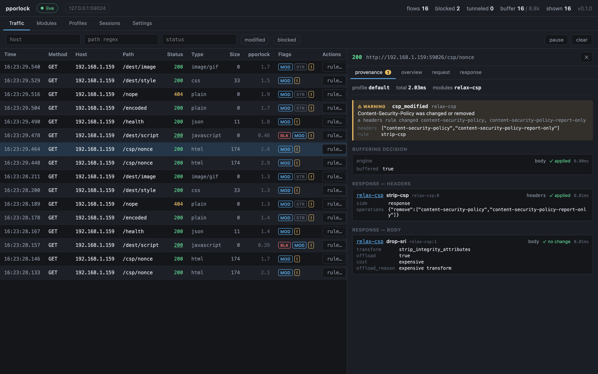
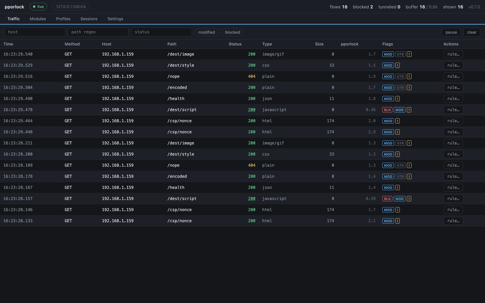
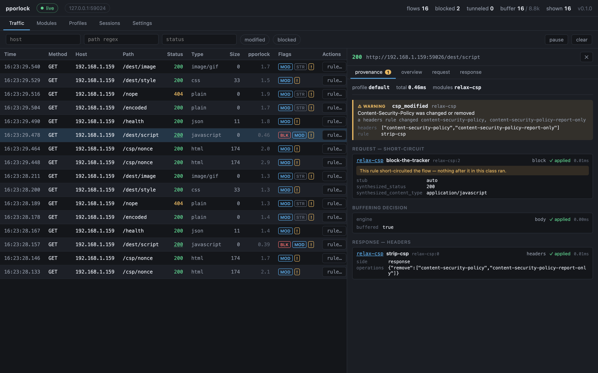
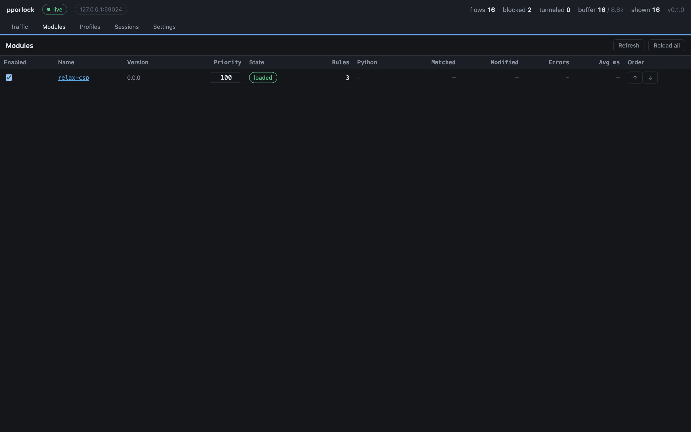
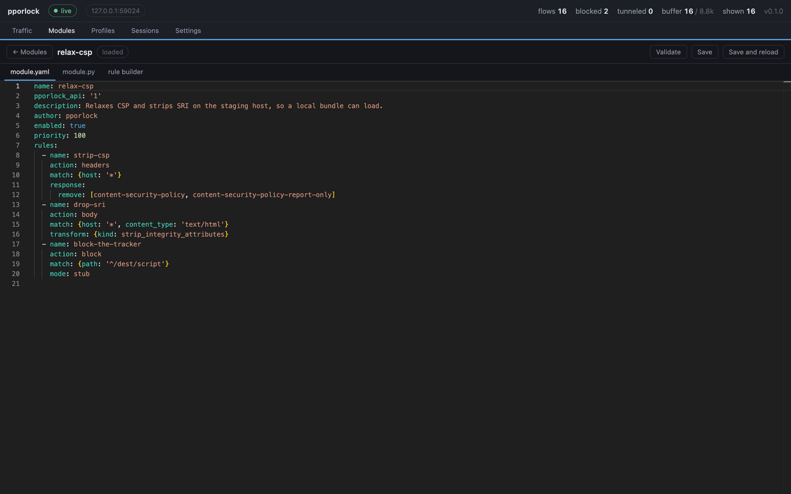
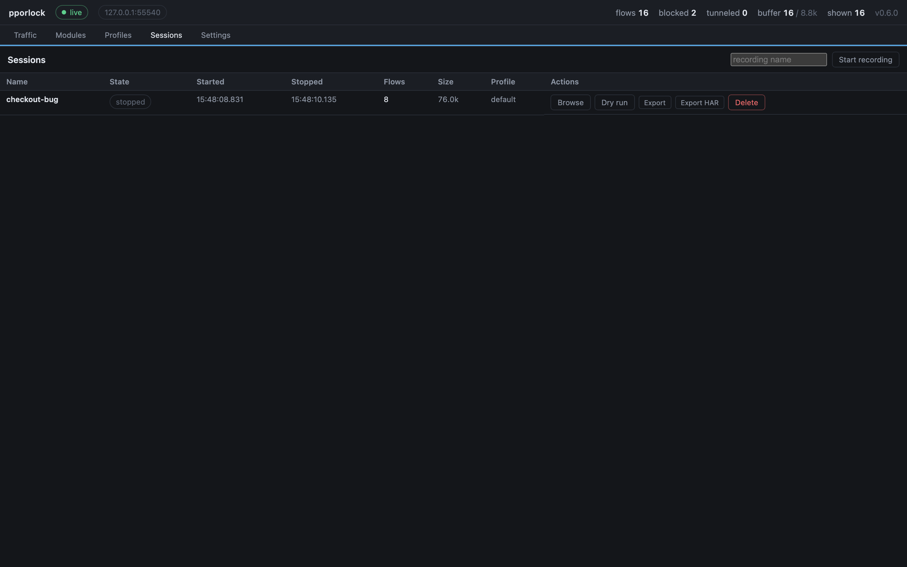

# pporlock

[](https://github.com/thowland/pporlock/actions/workflows/gate.yml)
[](LICENSE)

**Local HTTPS interception and modification for Chrome, on macOS.**

Point Chrome at a proxy you control, watch every request, and change the ones
you need to — with a structured, per-flow record of exactly what was changed and
why.

> ⚠️ pporlock decrypts your HTTPS traffic and can rewrite any page. It runs
> unsandboxed module code with your full privileges. It is a single-user tool for
> a machine you own. Read [the security model](#security-model) before installing.

---

## The problem it solves

Every tool in this space fails the same way: **the page is subtly wrong.** Not
broken with an error — wrong. A button does nothing, a widget never appears, a
font falls back. Something in your rule set did it, three rules deep, and
nothing anywhere says what.

pporlock's answer is that **provenance is a structural return value of the
engine, not a log line.** Every flow carries a record of every rule that was
considered, what it did, and what it didn't do and why. That record is the
product; the proxy is how it gets made.



Read it top to bottom: a `csp_modified` warning naming the module responsible,
the buffering decision, the rule that applied in the response-header phase, and
a body transform that ran and reported `no change` — with the reason it was
offloaded. Nothing here is inferred from logs.

---

## What's in the box

| | |
|---|---|
| **Daemon** | mitmproxy-based proxy, rules engine, capture, and control API. Serves the web UI. |
| **Web UI** | Live traffic, provenance, module authoring, sessions, dry run. |
| **Extension** | The only thing that can point Chrome at the proxy. Owns the fail-safe. |
| **MCP server** | Lets an agent read provenance and author modules — with guardrails it cannot route around. |

---

## Live traffic



Every flow, as it happens, with the flags that matter: `BLK` blocked, `MOD`
modified, `STR` streamed (so body rules could not run), `!` a warning worth
reading. The `pporlock` column is the milliseconds this system added to that
flow.

Two clicks from any row to a pre-filled rule.

When a rule ends a flow, the record says so in those words, and shows what was
served instead:



"An earlier rule ate it" is the single most common confusion once a rule set
grows past a handful, so it is stated rather than left to be worked out.

## Modules



A module is a directory: a manifest, optional Python, an assets tree. Declarative
rules cover blocking, redirecting, serving a local file, rewriting headers, and
transforming bodies through a fixed registry of named transforms. Python is
there for the conditions a rule cannot express.



Monaco, bundled locally — nothing on this page reaches a CDN. Validation errors
arrive as markers. Writing a rule back re-splices only that rule's source range,
so comments, blank lines, and quoting style survive untouched.

## Sessions



Record traffic to a SQLite file, browse it later with the same table and
provenance view as live, dry-run a candidate module against it, export it as HAR.

**Secrets are redacted at write time.** A session file has never contained the
real value, so there is nothing in it to leak. A test greps every byte of the
database, the WAL, and the shared-memory file — and a second test opens the file
from a subprocess that asserts `pporlock` was never imported, because a check
written against our own reader could pass merely because our reader redacts.

---

## Modules you can start from

```bash
make examples        # installs nine example modules, all disabled
```

`adblock`, `cookie-banners`, `css-tamper`, `local-bundle`, `header-lab`,
`json-tamper`, `fault-lab`, `ws-inspect` — covering every action and both
authoring tiers, each commented with the reasoning for its choices. They are
tested: `daemon/tests/unit/test_examples.py` loads every one and exercises the
behaviour worth pinning, which is also the closest thing here to a public API
conformance suite.

Read them before enabling them. [The cookbook](docs/module-cookbook.md) is the
reference they draw on.

---

## Install

Full instructions: **[docs/install.md](docs/install.md)**. The short version:

```bash
make setup
make install          # puts `pporlock` on your PATH (editable — see install.md)
make rebuild          # CLI, web UI, extension, examples

pporlock run          # generates the CA, then ctrl-c
pporlock install      # trusts it in your login keychain
```

Afterwards, `make rebuild` is what a `git pull` needs, and `make restart`
restarts the daemon so it serves the web UI you just built.

Then **disable QUIC** — `chrome://flags/#enable-quic` → Disabled → relaunch.
This step is not optional. Chrome speaks HTTP/3 over UDP to most large sites and
a proxy sees none of it; skipping this produces a partial capture with no error
anywhere, which is the most confusing failure the system can hand you.
`pporlock doctor` checks it.

Load `extension/dist/` unpacked at `chrome://extensions`, then:

```bash
pporlock run          # leave running
pporlock pair         # prints a code; type it into the popup
pporlock doctor       # 18 checks
```

---

## Documentation

| | |
|---|---|
| [Install](docs/install.md) | Setup, verification, and complete uninstall |
| [Tutorial: a declarative module](docs/tutorial-declarative-module.md) | Build one from an empty directory, runnable against the in-repo fixture |
| [Tutorial: a Python module with state](docs/tutorial-python-module.md) | Hooks, cross-flow state, synthesised responses, failing well |
| [Module authoring](docs/module-authoring.md) | Both tiers, the transform registry, the `ctx` API, the trust model |
| [Module cookbook](docs/module-cookbook.md) | The deep reference — matching, recipes, ordering, performance, debugging |
| [Example modules](examples/README.md) | Nine working modules: adblock, cookie banners, CSS tampering, local builds, fault injection, a GPC cookie audit |
| [Driving it with an LLM](docs/llm-with-mcp.md) | A pasteable system prompt, worked scenarios, and how to review what an agent wrote |
| [Troubleshooting](docs/troubleshooting.md) | "The page is subtly wrong", from provenance to cause |
| [Worked example](docs/worked-example.md) | One problem end to end, via the UI and via MCP |
| [Control API reference](docs/api-reference.md) | Every route, generated from the OpenAPI spec |
| [Rule and manifest schema](docs/rule-schema.md) | Every field, generated from the JSON Schemas |
| [Open issues](docs/open-issues.md) | Known gaps, each with why it is still open |

Design and specification documents live in `docs/`: the requirements
(`pporlock_requirements-v1.md`), the contracts (`spec-0-contracts.md`), and one
spec per component.

`contracts/` holds the OpenAPI description and the JSON Schemas, and is the
source of truth for every cross-component shape. The two references above are
**generated** from it by `make docs`, and `make gate` fails if they have drifted
— a hand-maintained copy of a machine-readable contract is a copy that will
eventually disagree with it, and the disagreement gets found by whoever wrote a
client against the wrong half.

---

## Security model

Read this before you install. None of it is hedging.

**It decrypts your HTTPS.** Trusting the CA means any process running as you
that can reach the proxy can read your traffic to non-excluded hosts. That is
the tool working as designed. The CA goes in your **login** keychain, not the
System keychain — no admin password, and the blast radius is your account.
[Uninstall](docs/install.md#7-uninstalling) is documented and complete, and says
what it leaves behind.

**Module code is fully trusted.** No sandbox, no import allowlist, no resource
jail. A module runs in the proxy process with your privileges. This is a
deliberate decision: meaningful Python sandboxing is not achievable at a cost
proportionate to a local single-user tool, and a sandbox that does not hold is
worse than none because it invites trust it has not earned.

> **Read a module before you enable it. Especially one an AI wrote for you.**

Dry run executes Python hooks too — it must, or its result would not predict
live behaviour. Dry-running an unread module is not safer than enabling it.

**Modifications announce themselves.** Stripping SRI, relaxing CSP and injecting
scripts all weaken a page's own protections. When that happens, a banner appears
in the page naming the module responsible, in a closed shadow root the page
cannot reach into. It can be suppressed per host — and suppression silences the
warning, not the fact: the badge and the DevTools panel still report it.

**Secrets are masked by default.** Redaction happens at write time for sessions
and at serialize time for the API. Revealing a value is live-buffer-only,
web-UI-only, one value at a time, and audited. The MCP interface has **no**
unmask capability: the four spellings of it are refused inside the HTTP client
before the network, and again at the tool layer, and no tool schema names them.

**The agent cannot enable what it wrote.** `create_module` sends `{name, files}`
and nothing else; `enabled` is absent from its schema and a test drives it with
`enabled=true` to prove the wire body is unchanged. Turning a module on is
always a separate, deliberate act.

**The extension fails safe.** If the daemon stops answering, Chrome is returned
to a direct connection rather than left pointing at a proxy that is gone. It
does not silently re-enable when the daemon comes back.

**Everything binds loopback**, asserted in code — a non-loopback listen address
is rejected at startup. The daemon never touches macOS system proxy settings;
only Chrome is affected, and only through the extension.

---

## Development

```bash
make setup       # toolchains, contracts, git hooks
make all         # contracts -> daemon, web, extension
make gate        # coverage + tests + lint + security. Run before every merge.
make e2e         # Playwright (the extension suite is headed; MV3 needs it)
```

CI runs `make gate` itself rather than a hand-copied list of steps, so there is
one definition of green rather than two that drift.

`CLAUDE.md` documents the architecture's load-bearing rules — the ones that
break the design rather than the style — and the sprint close gates. Sprint
history, decisions and every bug found along the way are in
[docs/sprint-log.md](docs/sprint-log.md).
[CONTRIBUTING.md](CONTRIBUTING.md) is the short version: what to run, and the
four things the gate cannot check.

### Three things this project learned the expensive way

**Unit tests cannot tell you the daemon runs what you built.** Two sprints
shipped a complete, fully-tested module system that `runner.py` never
constructed, so none of it ran — every gate passed. A unit test builds the
objects it exercises and so cannot notice their absence. There is a
`TestStartupWiring` suite now, and exit demos are not a formality.

**A test that stubs your own client agrees with whatever your client believed.**
Three wire-shape bugs survived a 400-test suite and were found by taking a
screenshot of a running system. The screenshots in this README are generated by
`web/scripts/screenshots.mjs` against a real daemon for exactly that reason.

**A test that reads the working tree cannot tell you what you shipped.** The 33
default exclusions — the list that keeps this proxy away from OS updates,
certificate revocation and banking — were never committed, because a global
gitignore matched the directory. Six tests asserted the list was present and
non-trivial, and all six passed, on every machine that had the file sitting on
its disk. CI found it on its first run, being the first thing that had ever
looked at a fresh clone.

---

## Scope

macOS. Chrome. One user, one machine. It is not a team tool, not a CI tool, and
not a general-purpose proxy — and every design decision in it assumes so.

---

## Licence

Copyright © 2026 Tim Howland.

pporlock is free software: you can redistribute it and/or modify it under the
terms of the **GNU General Public License, version 3 or later**, as published by
the Free Software Foundation. See [LICENSE](LICENSE) for the full text.

It is distributed in the hope that it will be useful, but **without any
warranty** — without even the implied warranty of merchantability or fitness for
a particular purpose. See the licence for details.

### What this software does, stated plainly

pporlock terminates TLS, holds session cookies in memory, runs unsandboxed user
code, and can rewrite any page your browser loads. It installs a certificate
authority into your login keychain. Those are its features, not its side
effects.

Run it against systems you are authorised to inspect. The absence of warranty in
the licence is not a formality here: a tool that can modify any response can
break things, and the person operating it is the one who decides what it points
at.
